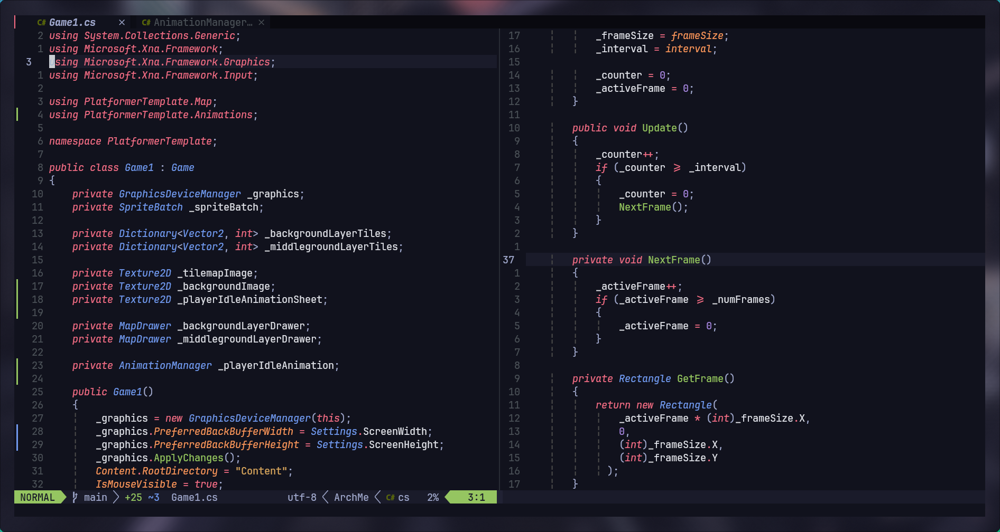

<h1 align="center" style="font-weight: bold;">SpectraNvim 🪄</h1>

<p align="center">
<a href="#technologies">Technologies</a>
<a href="#started">Getting Started</a>

 
</p>


<p align="center">A flexible and fast Neovim configuration designed for efficient work and easy customization.</p>


<h2 id="layout">🎨 Screenshots</h2>

<p align="center">



</p>

<h2 id="technologies">💻 Technologies</h2>

- Treesitter: nvim-treesitter/nvim-treesitter
- LSP Config: neovim/nvim-lspconfig
- Mason: williamboman/mason.nvim
- Trouble: folke/trouble.nvim
- Completion: hrsh7th/nvim-cmp, hrsh7th/cmp-nvim-lsp, hrsh7th/cmp-buffer, hrsh7th/cmp-path, hrsh7th/cmp-cmdline, onsails/lspkind.nvim
- Snippet Support: hrsh7th/cmp-vsnip, hrsh7th/vim-vsnip
- Utilities: windwp/nvim-autopairs, terrortylor/nvim-comment, max397574/better-escape.nvim, folke/todo-comments.nvim, lewis6991/gitsigns.nvim, Yggdroot/indentLine
- UI Enhancements: nvim-tree/nvim-tree.lua, nvim-telescope/telescope.nvim, nvimdev/dashboard-nvim, akinsho/toggleterm.nvim, folke/which-key.nvim, akinsho/bufferline.nvim, nvim-lualine/lualine.nvim, RRethy/vim-illuminate
- Icon Support: echasnovski/mini.icons, nvim-tree/nvim-web-devicons, norcalli/nvim-colorizer.lua
- Themes: catppuccin/nvim, morhetz/gruvbox, tiagovla/tokyodark.nvim, sainnhe/gruvbox-material
- Fun: Eandrju/cellular-automaton.nvim

<h2>🧩 Dependencies</h2>

Before installing, ensure you have the following dependencies installed:

- **Neovim**: v0.8.0 or higher
- **Git**: for cloning repositories
- **Node.js**: for some plugins like `nvim-treesitter`
- **Python 3**: for plugins requiring Python support
- **GCC/Clang**: for compiling Treesitter parsers
- **Ripgrep**: for Telescope's live grep functionality
- **Nerd Fonts**: for better icon support in the status line, file tree, etc.

<h2 id="started">🚀 Getting started</h2>

### Uninstall old config:
```bash
# Linux / MacOS (unix)
rm -rf ~/.config/nvim
rm -rf ~/.local/state/nvim
rm -rf ~/.local/share/nvim
```

### Install:
```bash
git clone https://github.com/df1gg/SpectraNvim.git ~/.config/nvim && nvim
```

- Delete the .git folder from nvim folder.

### Update:
- ```Lazy sync``` command


<h2 id="lsp">🔧 Setting Up LSP</h2>

1. Install the LSP servers using Mason:
```bash
:MasonInstall
# Example:
# :MasonInstall pyright
```
2. Configure LSP servers in your ```lua/configs/lspconfig.lua``` file:
```lua
-- Add your LSP in end file

-- Example for Python
nvim_lsp.pyright.setup{}

-- Example for Lua
nvim_lsp.lua_ls.setup{}

-- Example for C#
nvim_lsp.omnisharp.setup{
    cmd = { "dotnet", vim.fn.expand("~/.local/share/nvim/mason/packages/omnisharp/libexec/OmniSharp.dll") }
}
```

<h2 id="contribute">📫 Contribute</h2>

Here you will explain how other developers can contribute to your project. For example, explaining how can create their branches, which patterns to follow and how to open an pull request

1. `git clone https://github.com/df1gg/SpectraNvim.git`
2. `git checkout -b feature/NAME`
3. Follow commit patterns
4. Open a Pull Request explaining the problem solved or feature made, if exists, append screenshot of visual modifications and wait for the review!

<h3>Documentations that might help</h3>

[📝 How to create a Pull Request](https://www.atlassian.com/br/git/tutorials/making-a-pull-request)

[💾 Commit pattern](https://gist.github.com/joshbuchea/6f47e86d2510bce28f8e7f42ae84c716)
